# Cyber Instruct Dataset Pipeline

This project is a comprehensive, multi-stage pipeline designed to collect, filter, structure, and refine cybersecurity data into a high-quality, instruction-response dataset. The final output is suitable for training and fine-tuning Large Language Models (LLMs) to be proficient in cybersecurity-related tasks.

The pipeline is designed to be modular, running a series of scripts in sequence. It leverages local LLMs via the [MLX framework](https://github.com/ml-explore/mlx) for intelligent data processing, includes a human-in-the-loop review stage for quality assurance, and incorporates security alignment to ensure the final dataset is both helpful and safe.

## 📈 Pipeline Overview

The entire process transforms raw, unstructured data from various sources into a clean, validated, and aligned dataset. Each stage produces data in its own directory, allowing for inspection and resumption at any point in the pipeline.

```mermaid
graph TD
    subgraph "Stage 1: Collection"
        A[dataset_creation/1_data_collector.py] -->|API Calls, RSS, Scrapers| B[(dataset_creation/raw_data)]
    end
    subgraph "Stage 2: Filtering"
        B --> C[dataset_creation/2_data_filter.py]
        C -->|LLM Relevance Check| D[(dataset_creation/filtered_data)]
    end
    subgraph "Stage 3: Structuring"
        D --> E[dataset_creation/3_data_structurer.py]
        E -->|LLM Instruction Generation| F[(dataset_creation/structured_data)]
    end
    subgraph "Stage 4: Classification"
        F --> G[dataset_creation/4_domain_classifier.py]
        G -->|LLM Domain Tagging| H[(dataset_creation/domain_classified)]
    end
    subgraph "Stage 5: Human Review"
        H --> I[dataset_creation/5_manual_reviewer.py]
        I -->|CLI-based Review| J[(dataset_creation/reviewed_data)]
    end
    subgraph "Stage 6: Security Alignment"
        J --> K[dataset_creation/6_security_aligner.py]
        K -->|Injects Security Examples| L[(dataset_creation/security_aligned)]
    end
    subgraph "Stage 7: Final Assembly"
        L --> M[dataset_creation/8_final_assembler.py]
        M -->|Deduplication & Validation| N[[🏆 dataset_creation/final_dataset]]
    end
```



## ✨ Features

- **Modular Pipeline**: Each step is an independent script, making the process transparent and easy to debug.
- **Diverse Data Sources**: Gathers data from NVD, MITRE ATT&CK, OpenCVE, CAPEC, Exploit-DB, vendor advisories (Microsoft, Ubuntu), and more.
- **LLM-Powered Processing**: Uses local MLX models for intelligent filtering, instruction generation, and domain classification without relying on external APIs.
- **Human-in-the-Loop Review**: Includes a user-friendly CLI tool for manual review, correction, and quality rating of the generated data.
- **Security & Safety Alignment**: Enriches the dataset with synthetically generated, security-focused examples (e.g., phishing, malware analysis) to improve the model's robustness and safety awareness.
- **Configurable & Extensible**: Easily add new data sources, filtering logic, or structuring prompts.

## 🚀 Prerequisites

This pipeline is designed to run on a machine with **Apple Silicon (M1/M2/M3/M4)** and Python 3.8+.

1.  **Python & Pip**: Ensure you have Python 3.8+ installed.
2.  **MLX Framework**: The core MLM-based scripts depend on Apple's MLX. Installation is handled via `pip`.
3.  **API Keys**: Several data sources require API keys. You should create a `.env` file in the root directory to store these secrets.

### Environment Variables

Create a file named `.env` in the project's root directory and populate it with your keys:

```bash
# GitHub token for accessing certain repositories
GITHUB_TOKEN="your_github_token"

# NVD API for CVE data (https://nvd.nist.gov/developers/request-an-api-key)
NVD_API_KEY="your_nvd_api_key"

# OpenCVE credentials for CVE data (https://www.opencve.io/)
OPENCVE_EMAIL="your_opencve_email"
OPENCVE_PASSWORD="your_opencve_password"

# Optional API keys for other sources
VIRUSTOTAL_API_KEY="your_vt_api_key"
ALIENVAULT_API_KEY="your_otx_api_key"
SHODAN_API_KEY="your_shodan_api_key"
# ... and any other keys used in 1_data_collector.py
```

### Python Dependencies

Install the required Python packages using the following command:

```sh
pip install -r requirements.txt
```

A `requirements.txt` file should be created with the following contents:

```text
requests
beautifulsoup4
feedparser
pandas
pyyaml
tqdm
mlx
mlx-lm
rich
questionary
jinja2
jsonschema
python-dotenv
```

## ⚙️ How to Run the Pipeline

Run the scripts sequentially from your terminal. It's recommended to run them in the specified order, as each script consumes the output of the previous one.

### 1. Stage 1: Collect Data

Fetch raw data from all configured sources.
```sh
python3 dataset_creation/1_data_collector.py --sources all
```
- **Input**: None (fetches from web sources/APIs).
- **Output**: Raw JSON files in the `./dataset_creation/raw_data/` directory.

### 2. Stage 2: Filter Data

Filter the raw data for cybersecurity relevance and enhance it using a local LLM.
```sh
python3 dataset_creation/2_data_filter.py
```
- **Input**: Files from `./dataset_creation/raw_data/`.
- **Output**: Filtered and enhanced data in the `./dataset_creation/filtered_data/` directory.

### 3. Stage 3: Structure Data

Convert the filtered data into a consistent instruction-response format.
```sh
python3 dataset_creation/3_data_structurer.py
```
- **Input**: Files from `./dataset_creation/filtered_data/`.
- **Output**: A consolidated JSON file in the `./dataset_creation/structured_data/` directory.

### 4. Stage 4: Classify Data

Classify each instruction-response pair into a predefined cybersecurity domain.
```sh
python3 dataset_creation/4_domain_classifier.py
```
- **Input**: The consolidated file from `./dataset_creation/structured_data/`.
- **Output**: A classified JSON file in the `./dataset_creation/domain_classified/` directory.

### 5. Stage 5: Manual Review

Launch the interactive CLI to manually review, edit, and approve the classified data.
```sh
python3 dataset_creation/5_manual_reviewer.py
```
- **Input**: The classified file from `./dataset_creation/domain_classified/`.
- **Output**: A reviewed JSON file in the `./dataset_creation/reviewed_data/` directory, along with session statistics.

### 6. Stage 6: Align for Security

Enhance the dataset and inject synthetic security-focused examples to improve safety.
```sh
python3 dataset_creation/6_security_aligner.py --ratio 0.2
```
- **Input**: The reviewed file from `./dataset_creation/reviewed_data/`.
- **Output**: An aligned and enhanced JSON file in the `./dataset_creation/security_aligned/` directory.

### 7. Stage 7: Assemble Final Dataset

Combine all processed data, remove duplicates, validate against a schema, and produce the final clean dataset.
```sh
python3 dataset_creation/8_final_assembler.py
```
- **Input**: The aligned file from `./dataset_creation/security_aligned/`.
- **Output**: The final `final_cybersecurity_dataset_{timestamp}.json` in the `./dataset_creation/final_dataset/` directory.

## 🔧 Configuration & Customization

- **Command-Line Arguments**: Most scripts accept command-line arguments. Use the `--help` flag to see available options (e.g., `python3 dataset_creation/2_data_filter.py --help`).
- **LLM Models**: You can change the local MLX model used in the scripts (`2_data_filter.py`, `3_data_structurer.py`, etc.) via the `--model` argument. The default models are chosen for a balance of performance and capability (e.g., `mlx-community/Phi-3-mini-4k-instruct-4bit`).
- **Data Sources**: To add a new data source, add a new `fetch_*` method in `dataset_creation/1_data_collector.py` and register it in the `all_sources` dictionary in `main()`. You will also need a corresponding handler in `dataset_creation/3_data_structurer.py` to convert its output to the instruction-response format.

## 📜 License

This project is licensed under the MIT License. See the LICENSE file for details.